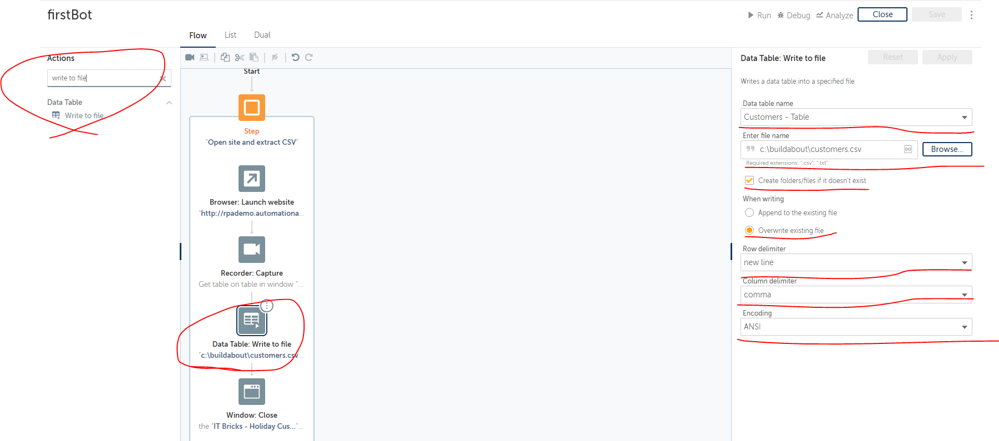

Automation Anywhere를 처음 사용해 봤습니다. 이런 걸 RPA(Robotic Process Automation)이라고 하는데요
컴퓨터로 하는 단순 반복 작업들을 컴퓨터가 대신 해주는 겁니다. 그렇다고 만능은 아니고 사람의 판단이 반드시 있어야 하는건 RPA를 적용하기 어렵습니다.

<iframe width="560" height="315" src="https://www.youtube.com/embed/zWZ_fHscvBA" frameborder="0" allow="accelerometer; autoplay; encrypted-media; gyroscope; picture-in-picture" allowfullscreen></iframe>

위 영상은 무료인 Automation Anywhere Communiti Edition으로 get started 강의를 보고 따라한 영상이에요

원본 강의 링크 [https://university.automationanywhere.com/](https://university.automationanywhere.com/)

위 링크의 'Hello A2019 Bot: Getting Started with Building Bots'이라는 45분 짜리 강의를 따라한 겁니다.

## 실행환경 구성

일단 Automation Anywhere에 [회원 가입](https://www.automationanywhere.com/products/community-edition)을 하고 communiti edition을 신청합니다. 그러면 메일이 한통 오는데요 거기에 또 edition 링크랑 아이디랑 비밀번호 같이 적혀있습니다. 링크 들어가서 이메일에 있는 아이디랑 비밀번호로 로그인 하면 됩니다.

그러면 콘솔창이 뜨는데요 제일 먼저 해줘야 하는 것은 내기기 탭에서 저 별표해놓은 버튼을 눌러서 클라우드에 내 컴퓨터를 등록해야 합니다. 저걸 누르면 뭘 다운로드 할건데요 그거 설치해야 콘솔 클라우드랑 내 컴퓨터랑 커뮤니케이션 할 수 있습니다.

그러면 이 버튼으로 봇을 만들어 주세요

이렇게 해서 봇창으로 오면 준비는 끝난겁니다.

## 작업 분석

평소 IT Bricks라는 가상의 회사에서 일을 하는 과정은 다음과 같습니다.

1. [고객 정보 웹페이지](http://rpademo.automationanywhere.com/itbricks_enroll.php)에서 고객정보를 확인한다.
2. 1번에서 확인한 정보로 [New Hollyday Club](http://rpademo.automationanywhere.com/itbricks_enroll.php)에 가입한다.
3. 고객 정보와 가입 완료 여부를 엑셀로 만들어서 저장한다.
4. 엑셀을 다른 동료에게 메일에 첨부하여 보낸다.

## 설계

일단 활동에서 step을 끌어다가 start와 end 사이에 4개 가져다 놓습니다. step은 별다른 기능은 없고 작업을 큰 분류로 나눠주는 역할을 합니다. 일종의 함수나 객체라고 생각할 수 있겠네요

그 다음에 고객 정보창을 띄웁니다. URL은 http://rpademo.automationanywhere.com/itbricks_enroll.php 이고 브라우저는 인터넷 익스플로러로 해주세요 크롬으로 했더니 HTML정보를 못읽더라구요 **꼭 오른쪽 위에 Apply 버튼을 눌러주세요**

그 다음에 웹페이지에 있는 정보를 읽어오는 과정입니다. 오른 쪽 패널 보면 윈도우버튼에 리스트 선택창이 나오는데 꼭 오른쪽 재활용 뺑뻉이 버튼을 눌른 후에 선택해주세요 뺑뺑이 버튼을 누르면 클라두으가 전에 설치한 프로그램과 통신하며 브라우저가 뭐가 띄워져있는지 파악합니다.

그래서 Recapture Object 버튼을 누르기 전에 이 웹페이지가 인터넷 익스플로로 켜져있어야 해요 그리고 Recapture Object버튼을 누른후 마우스로 테이블에 가져다 대면 빨간 줄이 생기면서 HTML 탐지 영역을 결정합니다.

웹페이지에서 탐지한 정보를 변수에 저장해야 하는데요 왼쪽에 변수 탭을 누르면 변수를 만들수 있습니다. 변수 이름과 변수타입을 table로 지정해서 만들어 주세요 저는 이미 있으니 중복됐다고 빨간 경고가 뜨네요

그런 다음 오른쪽 패널에서 방금 변수를 지정하면 됍니다.

다음은 파일에 저장하는 작업입니다. 변수에 저장했던 데이터를 CSV파일에 저장합니다. CSV의 의미는 Comman seperated Value라고 해서 데이터를 반점으로 구분하는데요 그래서 column delimiter도 콤마로 합니다.

이렇게 해서 고객정보 창을 닫으면 첫번쨰 단계는 끝납니다.

저장 했던 엑셀 파일을 이제는 엽니다. 엑셀 어드밴스랑 엑셀 베이직의 차이는 모르겠지만 강의에 어드밴스로 하라고 하니 일단 합니다. 그리고 오른쪽 패널에 파일 경로는 위에 저장했던 경로 그대로 복사해서 가져옵니다. 그리고 엑셀파일에 header 즉 열의 이름이 들어가 있다고 체크를 해줍니다.

그 다음에 go to cell을 이용하는데요 go to cell은 파일 입출력에서 쓰기 커서를 지정하는 작업 같네요

이게 바로 G2셀인데요 이게 그대로 엑셀에 저장하는 거니까 엑셀파일에도 이 부분은 비어있을 겁니다 나중에 여기에다가 가입이 잘됐는지 차례로 내려가면서 적어줍니다.

이제 고객 정보를 저장하기 위한 register페이지를 엽니다. register URL입니다. http://rpademo.automationanywhere.com/itbricks_enroll.php

엑셀 데이터를 가져와서 customers table 변수에 모두 저장합니다.

엑셀에서는 고객정보가 테이블로 한꺼번에 저장되어 있는데 이거를 한줄 한줄 뽑아와서 FirstName LastName등등 열별로 구분하면서 입력을 해야합니다 이때 행별로 데이터를 뽑아오는 작업을 Loop로 합니다.오른쪽에 보면 반복 실행할 테이블과 행을 저장할 변수 customerROw를 설정했습니다. 이 변수는 Record타입으로 만든 다음에 할당하면 됩니다.

그다음에 it bricks 레지스터 페이지를 캡처해서 데이터를 입력해야 합니다. 이전에 테이블 뽑았던 것첯럼 진행 하되 이번엔 액션에서 set TExt를 설정하고 costomerRow의 firstname 데이터를 넣으면 됩니다. 이걸 Last Name, Company Name, Emain Address, Phone Number, Country Code, Register 버튼 까지 다 해주면 됩니다.

레지스터 버튼은 액션으로 클릭만 해주면 됩니다.

그러면 이제 레지스터 버튼 까지 잘 눌러서 저장했다고 엑셀에 있는 status 열을 채우는 작업을 더 해야합니다.

레지스터를 직접 해보면 알수 있는데요 저 부분이 글자가 잘 저장되었다고 바뀌는 것을 볼 수 있습니다. 우리는 저 글귀를 또 뽑아와서 엑셀에 저장해 줄겁니다.

똑같이 캡처를 해주는데 이번에 get property 액션을 하고 HTML 프로퍼티중에 innerText를 가져옵니다. 그리고 이것을 status라는 변수의 타입을 any로 만들어서 거기에 할당합니다.

set sell 을 설정하는데 이번에 status변수에 저장되어 있던 데이터를 저장합니다. 지금은 쓰기 커서가 G2에 있으니 G2에 데이터가 써질겁니다.

그다은 go to cell을 또 불러와서 쓰기 커서를 한 행 아래로 내립니다. 다음 작업에서는 데이터가 G3 그다음 작업에서는 G4이런식으로 계속 내려갈겁니다.

이제 마지막 스텝입니다. 엑셀 파일을 종료합니다.

send를 가져다 놓고 필요한 정보들을 입력합니다. 우리는 파일까지 첨부해줍니다.

그다음 이메일 서버 정보를 입력합니다. OUtLook을 사용하는 옵션도 있는데 저는 OutLook이 없어서 smtp를 사용했습니다. 구글 이메일 서버는 보안이 까다로워서 안돼는거 같고 네이버 이메일 서버는 되는거 같습니다.
[https://mail.naver.com/option/imap](https://mail.naver.com/option/imap)네이버 메일 서버 링크고 거기에 좀 찾다보면 smtp 쓰는법 다 나옵니다.그래서 필요한 정보 다 찾아서 입력하면 됍니다. 그리고 다 저장하고 실행 하면 

끝!!
