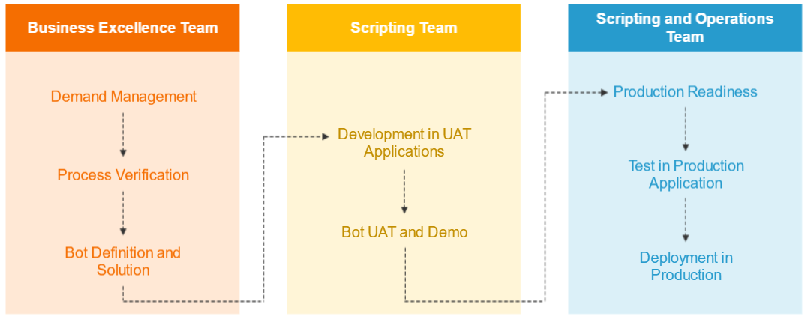

일단 봇을 만들었으면 다른 사람들이 또만드는게 아니라 다같이 나눠서 써야겠죠? 그렇게 배포하는 것을 deployment라고 하는데요 오늘은 이 deployment에 대해 알아보겠습니다.

[원본강의](https://university.automationanywhere.com/component/search/?searchword=deploy&ordering=alphaasc&searchphrase=all&catid=2&courselanguage=1&artlevel=&audience=0&Itemid=119)에서 오른쪽 카드 "Let the Bot Run : Step By Step Approach To Deploy Bots Across Machines"제목으로 되어있는 강의를 보고 만들었습니다.

## 봇 개발에서 배포까지 전문가 조직 구성

COE(Center of Excellence) 라고 해서 봇 만드는데 전문가 조직을 구성합니다. 조직을 구성하는 팀은 아래와 같습니다.

- Bot Framework and Library Management Team
  - 재사용 가능한 봇과 스크립트 개발
  - 모범적인 사례, 범용 프레임워크, 빠르게 재사용 가능한 Meta-Bots 개발
- Demand Management Team
  - 자동화 가능성 식별
  - 프로세스 우선순위와 자동화 파이프라인 관리
- Risk and Control Team
  - 봇의 작동 리스크와 컨트롤 메소드 확인
  - 비밀번호 관리 정책 처리
- Production Support and Monitoring Team
  - 계속적인 runbook관리
  - 범용 인프라 문제 해결, bot 제품의 근본적인 문제 해결
- Research Team
  - 신기술 식별
  - internal demon관리와 개념증명(POCs Proof of Concepts)
- RPA Scripting Team
  - 스크립트 작성
  - 봇 배포

  ## 봇 개발에서 배포까지의 과정

  여기서도 팀별로 나누네요 위에랑 무슨차이인지 잘 모르겠습니다.

  

**Business Excellence Team**

봐도 모르겠지만 일단 한번 봅시다.
  - 평가와 우선순위를 정합니다. Process assessment and prioritization
  - BRD 문서작업 BRD Documents
  - 개발자들의 UAT Application 접근 관리 UAT Application(MainFrame, Web Apps, Windows applications) access for developers
  - 작업 흐름 문서화 Process flow documents
  - 작업흐름을 기반으로 솔루션 매핑 solution mapping with process flow
  - 봇 개발에 드는 노동(노력) 평가 Effort estimation in bot development
  - AA를 상대로 앱테스트 Application test againt Automation Anywhere

BRD란?

비즈니스 관점에서 프로젝트의 비즈니스 솔루션 세부 사항을 보유합니다. 비즈니스 요구 사항 문서는 고객의 요구와 기대에 대해서도 강조합니다.[https://reqtest.com/requirements-blog/business-requirements-document-brd/](https://reqtest.com/requirements-blog/business-requirements-document-brd/)

UAT Application이란?

소프트웨어 개발에서 응용 프로그램 테스트 및 최종 사용자 테스트라고도하는 UAT (사용자 승인 테스트)는 의도 한 대상이 소프트웨어를 "실제"로 테스트하는 소프트웨어 개발 단계입니다.[https://searchsoftwarequality.techtarget.com/definition/user-acceptance-testing-UAT](https://searchsoftwarequality.techtarget.com/definition/user-acceptance-testing-UAT)

**scripting Team**

- Modulation of bots as independent deliverable entities
- Development in UAT Applications
- Parameterize parameters which will change from development to produnction in configurations
- Continuous communications with demand management to discuss the changes and demo of progressed bot

**Scripting and Operations Team**

- Bug fixing
- Test environment's test acceptance approval
- Bot performance assessment
- Bot machines count estimations
- Robotics ID access raised for production application involved in automation process
- Process owner trainning(education on how to run bots, raise issues, password change)
- configurations file changes and standardization
- Bug fixing which appeared because of bot migration into production environment
- Bot production deployment and execute production parallel phase
