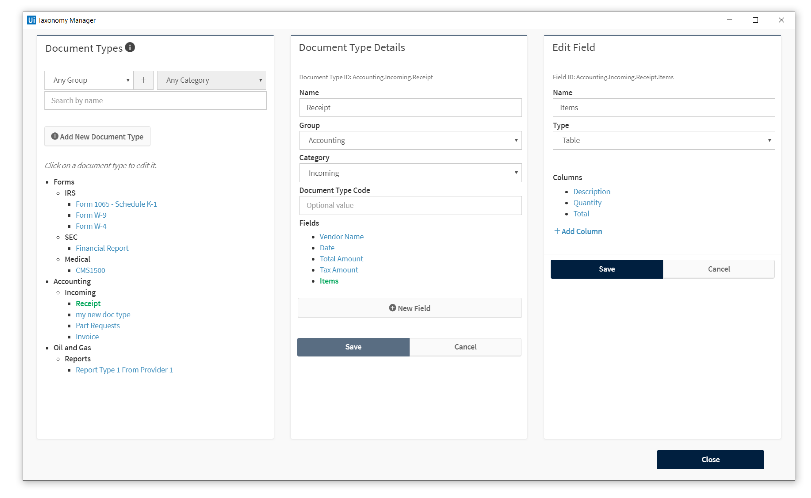

> 참고 : [uipath academy](https://www.uipath.com/rpa/academy)

Document understanding은 문서의 종류를 구분하고, 디지털 데이터로 전환하는 기술입니다.

## What is Document?

문서의 유형은 다음과 같이 3가지로 나뉩니다.

- Structured : 형태가 일정한 문서입니다. (tax forms, 설문지)
- semi-Structured : 내용의 key-value 쌍을 이루지만 그 위치나 데이터가 엄격한 형식을 따르지 않습니다. (invoice, 영수증)
- unstructured : 구조가 매번 뒤죽박죽인 문서

분류 문서에 따라 데이터 추출 방법이 다릅니다.

- rule-based data extraction
  - 문서의 형태가 항상 같고 앞으로도 같아야 합니다.
- model-based data extraction
  - semi-structured, unstructured 문서의 데이터를 추출할 때 사용합니다. 머신러닝을 할 수 있는 인프라와 기술 역량이 있어야합니다.

## OCR vs DocumentUnderstanding

데이터 추출에 관련된 액티비티는 모두 intelligent OCR 패키지에 포함되어있습니다.

문서는 5 단계를 거쳐서 처리됩니다.
1. 문서 유형과 추출할 데이터 정의
2. 문자와 문자의 위치 제공
3. 문서 유형 분류
4. 데이터 추출
5. 추출된 데이터 사람이 검증

OCR은 dizitize 단계에서 사용합니다.

## Document Understanding Framework

문서의 종류는 세가지가 있습니다. Structured, semi-structured, unstructured. 이 문서 종류에 따라 rule-based 추출, model-based 추출을 선택해야합니다.

이때 문제는 어떤 structured 문서는 rule-based만 가지고서 특정 데이터를 추출하는데 한계가 있기때문에 rule-based 이상의 방법론이 필요합니다. 이처럼 unstructured, semi-structured 또한 model-based 추출만으로 해결할 수 없는 문제가 있습니다.

Document Unserstanding Framework는 다양한 문서에 대해 다양한 접근법을 사용할 수 있도록 설계되었습니다.

1. Taxonomy

  전처리 단계입니다. 다양한 문서들의 종류와 각 종류마다 원하는 데이터를 정합니다.
  예를 들어 영수증의 경우 추출하고자 하는 데이터는 vendor, 총 금액이 있고, medical form의 경우 피보험자 ID, 환자 이름 등이 있습니다.
2. Dizitication

  문서 이미지를 OCR을 통해 디지털 데이터로 변환 합니다. 출력으로 Document Object Model과 Ocr 결과 문자열이 있습니다.

3. Classification

  입력된 문서(이미지)의 문서 유형이 정해집니다. 이떄 하나의 Classification scope에 여러 종류의 classifier를 사용할 수 있습니다.

4. Extraction

  문서에서 원하는 위치의 데이터를 추출합니다.

5. validation

  추출된 데이터를 사람이 검증합니다. 가장 좋은 것은 사람의 검증을 할지 말지 결정하는 로직을 validation전에 실행하는 것입니다.

6. Export

  Data Table로 추출합니다.

7. Training Classifier and Extractors

  분류나 추출이 제대로 되지 않은 문서는 학습을 시킵니다.

## Taxonomy

## Digitize

What is Document Object Model?

Document Object Model에는 문서이름, content type, text length, 각 페이지에 대한 정보, rotation, 각 글자의 위치등이 있습니다. 이 데이터는 Document 변수에 할당되어 이후 작업에 사용됩니다.

## classification

Keyword based classifier와 intelligent keyowrd based classifier, ML classifier사용가능 별로 볼게 없다.

## Data Extraction

Data Extraction Scope 액티비티 사용법 설명 역시나 볼게 없다.
